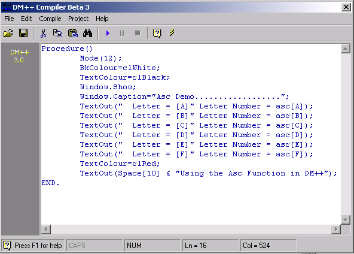



## DM\+\+ Programming Language Beta 3

### Description

Hi this is another updated verision of my DM++ Programming Language project. I have fixed some errors and added some more functions Like Blinking Text it also now opens in a new window when you compile like D++ and JEL I have aslo include all the projects in a project folder that use the new functions I think there is about 8 or 10 new Projects. You will aslo see that I have added other things like Auto Indent like in VB and Error Checking that you can trun on or off and put Options to change the Editors Back colour and Forecolour, Fonts etc. Also added the Char and ASC. anyway see the screen shot and tell us what you think any new I am aslo looking for help to try and Inplant If Function and For Functions so if you have any info let us know.. Thanks Please Vote if you like it..........
 
### More Info
 

             |
---                |---
**Submitted On**   |2001-01-23 23:20:26
**By**             |[dreamvb](https://github.com/Planet-Source-Code/PSCIndex/blob/master/ByAuthor/dreamvb.md)
**Level**          |Intermediate
**User Rating**    |5.0 (75 globes from 15 users)
**Compatibility**  |VB 6\.0
**Category**       |[Complete Applications](https://github.com/Planet-Source-Code/PSCIndex/blob/master/ByCategory/complete-applications__1-27.md)
**World**          |[Visual Basic](https://github.com/Planet-Source-Code/PSCIndex/blob/master/ByWorld/visual-basic.md)
**Archive File**   |[CODE\_UPLOAD140601222001\.zip](https://github.com/Planet-Source-Code/dreamvb-dm-programming-language-beta-3__1-14628/archive/master.zip)

